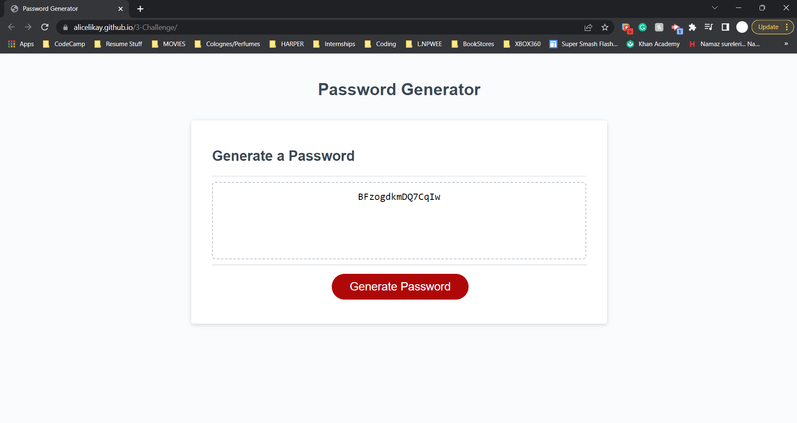

# JavaScript Random Password Generator

## Description
This code will generate a random password, any where between 8-128 charecters, with lower/uppercase charecters, numbers, or special charecters. These criteria are specified by the user. When the user clicks on the 'Generate Password' button inside the application, the criteria UI that the user sees are javascript alerts, confirmations, and prompts. 

## Table of Contents
* [Usage](#usage)
* [Screenshots](#screenshots)
* [Contacts](#contacts)

## Usage
Checkout my application: [Link](https://alicelikay.github.io/3-Challenge/) 

## Screenshots

## Contacts
### GitHub: 
[My Github](https://github.com/AliCelikay)
### LinkedIn: 
[My LinkedIn](https://www.linkedin.com/in/alicelikay/)
### Email:
alicelikay129@gmail.com
